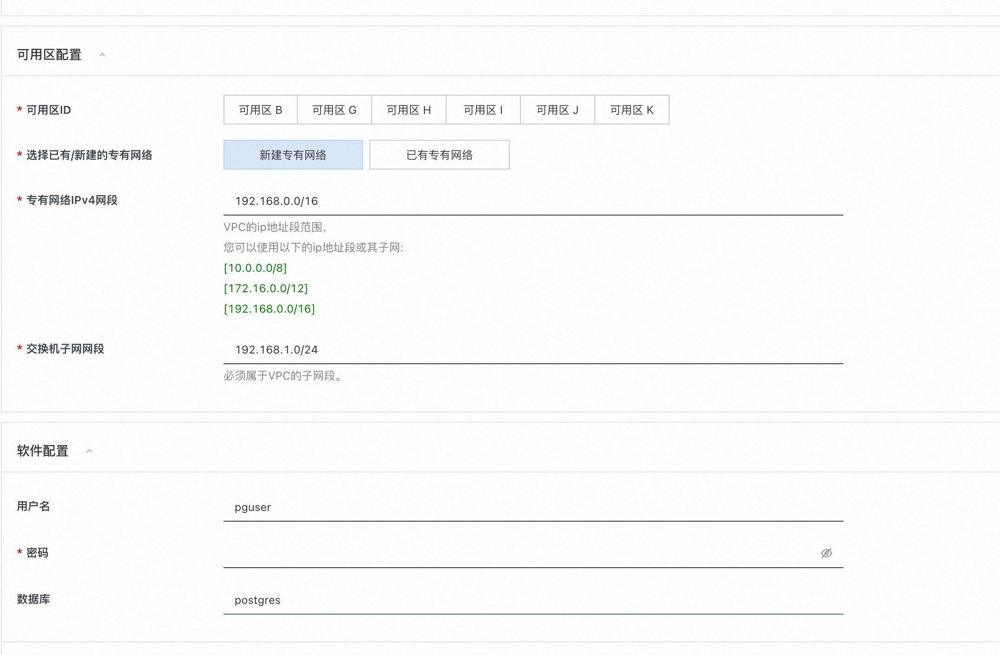

# PostgreSQL 服务实例部署文档

## PostgreSQL介绍
PostgreSQL是一种特性非常齐全的自由软件的对象-关系型数据库管理系统（ORDBMS），是以加州大学计算机系开发的POSTGRES，4.2版本为基础的对象关系型数据库管理系统。POSTGRES的许多领先概念只是在比较迟的时候才出现在商业网站数据库中。PostgreSQL支持大部分的SQL标准并且提供了很多其他现代特性，如复杂查询、外键、触发器、视图、事务完整性、多版本并发控制等。同样，PostgreSQL也可以用许多方法扩展，例如通过增加新的数据类型、函数、操作符、聚集函数、索引方法、过程语言等。另外，因为许可证的灵活，任何人都可以以任何目的免费使用、修改和分发PostgreSQL

## 计费说明
PostgreSQL在阿里云上的费用主要涉及：
* 所选CPU云服务器的规格
* 磁盘容量
计费方式：按量付费（小时）或包年包月
预估费用在创建实例时可实时看到。

## 部署架构

部署架构采用ECS(云服务器)单机部署


## RAM账号所需权限

| 权限策略名称                          | 备注                     |
|---------------------------------|------------------------|
| AliyunECSFullAccess             | 管理云服务器服务（ECS）的权限       |
| AliyunVPCFullAccess             | 管理专有网络（VPC）的权限         |
| AliyunROSFullAccess             | 管理资源编排服务（ROS）的权限       |
| AliyunComputeNestUserFullAccess | 管理计算巢服务（ComputeNest）的用户侧权限 |


## 部署流程

### 部署步骤


1. 单击部署链接，进入服务实例部署界面，根据界面提示，填写参数完成部署。
2. 参数填写完成后可以看到对应询价明细，确认参数后点击**下一步：确认订单**


3. 确认订单完成后同意服务协议并点击**立即创建**
4. 等待部署完成后就可以开始使用服务，进入服务实例详情点击Address访问。

5.使用服务，可以通过资源找到对应的ecs登录，然后使用psql命令链接数据库


```
sudo su root
systemctl status postgresql
psql -h 127.0.0.1 -p 5432 -U pguser -d postgres
```

